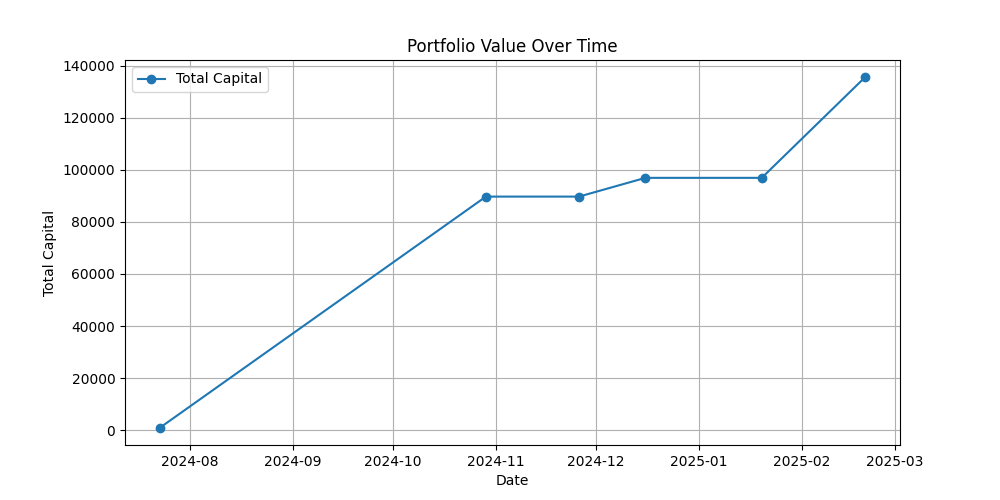
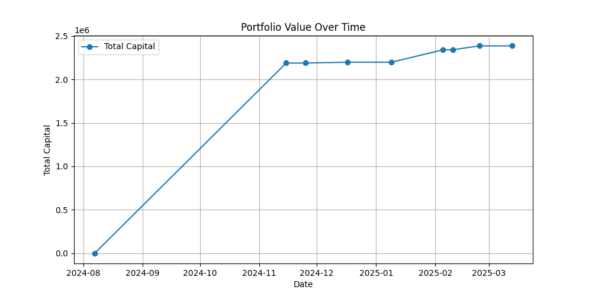
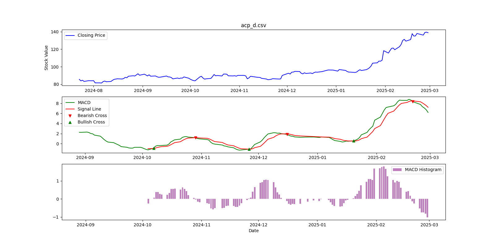
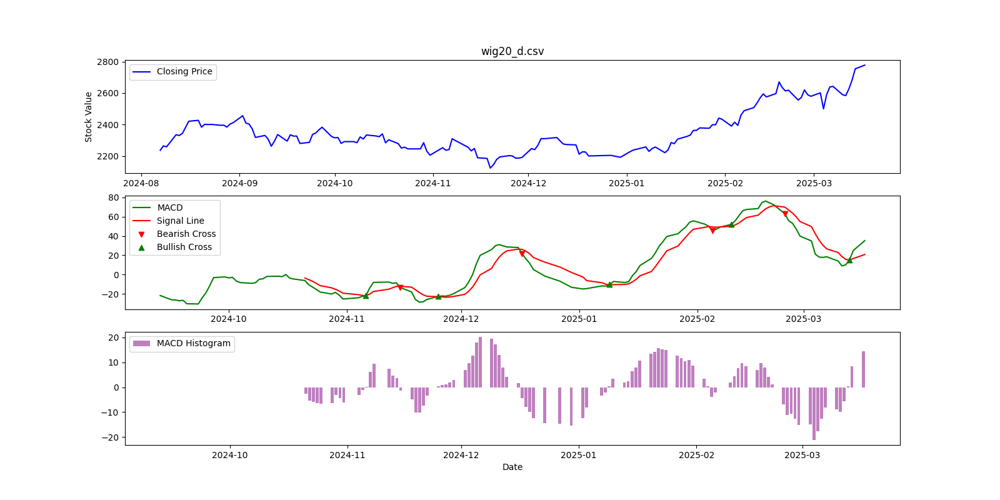

## Analiza Bota Handlującego na podstawie MACD

### Wstęp
Wskaźnik **MACD** (Moving Average Convergence Divergence) to popularne narzędzie analizy technicznej stosowane w tradingu, które służy do identyfikacji zmian momentum na rynku. Składa się z trzech głównych elementów:

1. **Linia MACD** – różnica między krótkoterminową (zwykle 12-okresową) i długoterminową (zwykle 26-okresową) średnią kroczącą.
2. **Linia sygnałowa** – wygładzona średnia krocząca (zwykle 9-okresowa) linii MACD.
3. **Histogram MACD** – różnica między linią MACD a linią sygnałową, która wizualizuje siłę i kierunek trendu.

Program został opracowany w celu automatycznego podejmowania decyzji o kupnie lub sprzedaży instrumentu finansowego na podstawie sygnałów generowanych przez wskaźnik **MACD**. Symulacja została przeprowadzona z kapitałem początkowym wynoszącym 1000 jednostek instrumentu finansowego. Analizowany okres wynosi 150 ostatnich dni z zawartych danych. Analiza obejmuje zmiany wartości portfela inwestycyjnego oraz skuteczność transakcji.

---

### Wyniki Symulacji dla acp_d
- **Analizowany okres**: od 2024-07-23 do 2025-02-28
- **Kapitał początkowy:** 1000 jednostek
- **Kapitał końcowy:** 135526.42 jednostek
- **Liczba transakcji:** 4 (2 kupna, 2 sprzedaże)

#### Analiza Transakcji dla acp_d
1. **SELL 2024-10-29**: Sprzedano instrumenty za 89750.0 jednostek po cenie 89.75.
2. **BUY 2024-11-26**: Zakupiono 1044.21 jednostek za 85.95 jednostek każda.
3. **SELL 2024-12-16**: Sprzedano instrumenty za 96955.06 jednostek po cenie 92.85.
4. **BUY 2025-01-20**: Zakupiono 1003.16 jednostek za 96.65 jednostek każda.
5. **SELL 2025-02-20**: Sprzedano instrumenty za 135526.42 jednostek po cenie 135.1.

---

### Wyniki Symulacji dla wig20_d
- **Analizowany okres**: od 2024-08-07 do 2025-03-17
- **Kapitał początkowy:** 1000 jednostek
- **Kapitał końcowy:** 2386334.55 jednostek
- **Liczba transakcji:** 7 (4 kupna, 3 sprzedaże)

#### Analiza Transakcji dla wig20_d
1. **SELL 2024-11-15**: Sprzedano instrumenty za 2188750.0 jednostek po cenie 2188.75.
2. **BUY 2024-11-25**: Zakupiono 993.64 jednostek za 2202.76 jednostek każda.
3. **SELL 2024-12-17**: Sprzedano instrumenty za 2197821.93 jednostek po cenie 2211.89.
4. **BUY 2025-01-09**: Zakupiono 977.70 jednostek za 2247.94 jednostek każda.
5. **SELL 2025-02-05**: Sprzedano instrumenty za 2341329.46 jednostek po cenie 2394.72.
6. **BUY 2025-02-10**: Zakupiono 933.72 jednostek za 2507.54 jednostek każda.
7. **SELL 2025-02-24**: Sprzedano instrumenty za 2386334.55 jednostek po cenie 2555.74.
8. **BUY 2025-03-13**: Zakupiono 889.41 jednostek za 2683.05 jednostek każda.

---

### Wykresy
- **Wartość Portfela:** Wykres ilustruje wzrost wartości portfela inwestycyjnego po każdej transakcji, osiągając końcową wartość 135526.42 jednostek dla **acp_d** i 2386334.55 jednostek dla **wig20_d**.
- **MACD:** Wykres pokazuje sygnały kupna i sprzedaży na podstawie przecięcia linii MACD i Signal Line.

---

### Skuteczność Transakcji
- **Transakcje z zyskiem:** Wszystkie transakcje zakończyły się zyskiem, co wskazuje na wysoką skuteczność zastosowania wskaźnika **MACD** w tym przypadku.
- **Skuteczność MACD:** Wskaźnik **MACD** okazał się skuteczny w generowaniu sygnałów kupna i sprzedaży, prowadząc do znaczącego wzrostu kapitału.

---

### Wnioski
Program oparty na wskaźniku **MACD** wykazał wysoką skuteczność w automatycznym handlu, prowadząc do znacznego wzrostu kapitału inwestycyjnego. Wszystkie transakcje zakończyły się zyskiem, co potwierdza przydatność **MACD** w podejmowaniu decyzji inwestycyjnych. Wykresy ilustrujące zmiany wartości portfela oraz sygnały MACD stanowią dodatkowe potwierdzenie skuteczności zastosowanej strategii.

---

### Zalecenia
- **Dalsze testy:** Warto przeprowadzić dodatkowe testy na różnych zestawach danych, aby zweryfikować skuteczność strategii w różnych warunkach rynkowych.
- **Optymalizacja:** Można rozważyć optymalizację parametrów **MACD**, aby dostosować strategię do specyfiki danego instrumentu finansowego.

---

### Pliki
- **acp_d.csv-capital.png:** Wykres wartości portfela dla **acp_d**.
- **acp_d.csv-macd.png:** Wykres wskaźnika **MACD** dla **acp_d**.
- **wig20_d.csv-capital.png:** Wykres wartości portfela dla **wig20_d**.
- **wig20_d.csv-macd.png:** Wykres wskaźnika **MACD** dla **wig20_d**.

---
