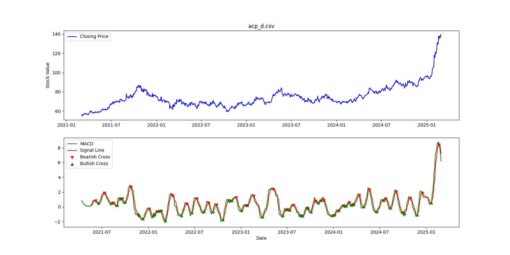
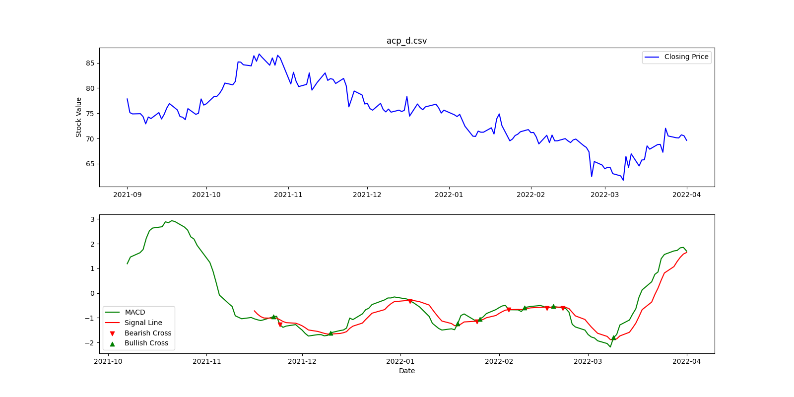
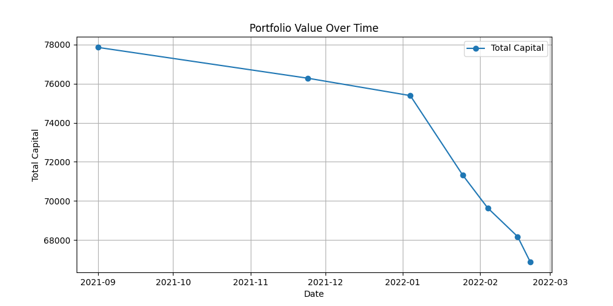
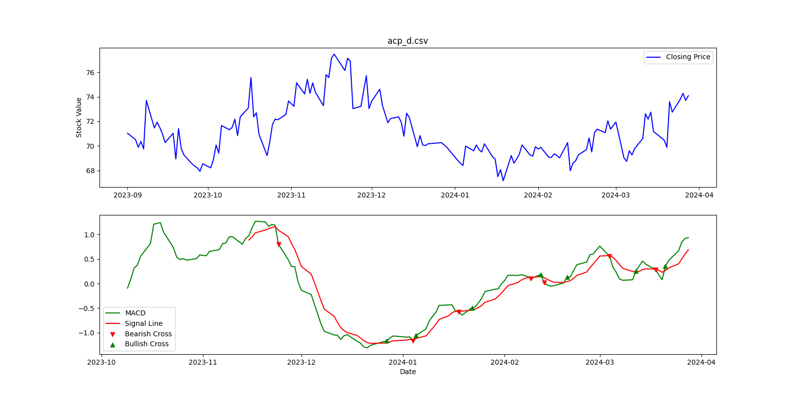
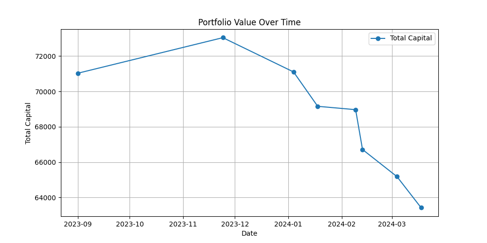
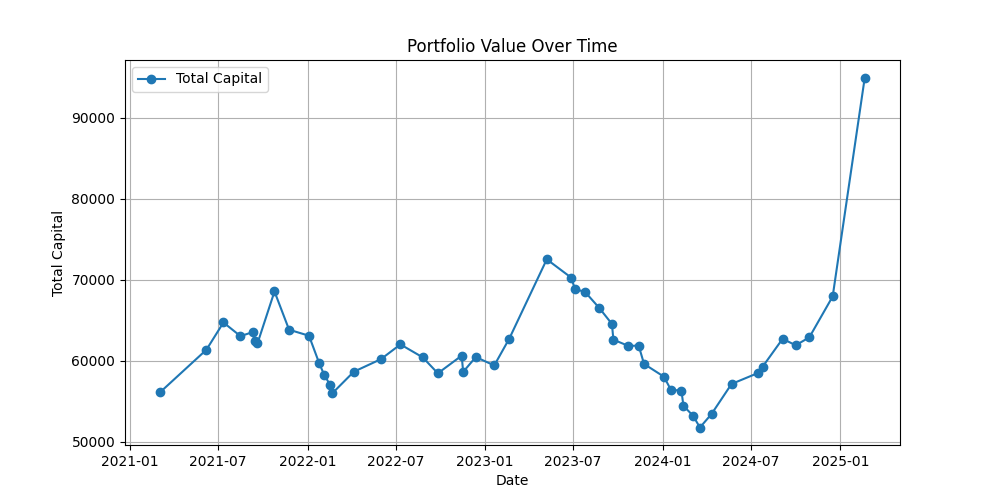

## Wstęp

### **EMA**
Wartość EMA dla $i$-tego przedziału czasu można obliczyć rekurencyjnie za pomocą zależności:

$$
EMA_N = \frac{p_0 + (1 - \alpha) p_1 + (1 - \alpha)^2 p_2 + \dots + (1 - \alpha)^N p_N}
{1 + (1 - \alpha) + (1 - \alpha)^2 + \dots + (1 - \alpha)^N}
$$

gdzie:

- $p_i$ jest próbką z i-tego dnia, $p_0$ jest próbką z aktualnego dnia, $p_N$ - to próbka sprzed
$N$ dni.
- liczba okresów: $N$,
- współczynnik wygładzający: $\alpha = \frac{2}{N + 1}$.

### **MACD**
Wskaźnik **MACD** (Moving Average Convergence Divergence) to popularne narzędzie analizy technicznej stosowane w tradingu, które służy do identyfikacji zmian momentum na rynku. Składa się z trzech głównych elementów:

1. **Linia MACD** – różnica między krótkoterminową (zwykle 12-okresową) i długoterminową (zwykle 26-okresową) średnią kroczącą.
2. **Linia sygnałowa** – wygładzona średnia krocząca (zwykle 9-okresowa) linii MACD.
3. **Histogram MACD** – różnica między linią MACD a linią sygnałową, która wizualizuje siłę i kierunek trendu.

### Wejście

Wejście składa się z dwóch zestawów danych: **acp_d** które zawierają historyczne notowania odpowiednich instrumentów finansowych.

### **Struktura wejścia:**

Każdy zbiór danych to tabela, w której każda kolumna reprezentuje określoną cechę notowań giełdowych.

- **Data** – data notowania.
- **Cena zamknięcia** – wartość akcji na koniec dnia.

## Analiza MACD w pomocy przy kupnie sprzedaży

---

Pierwszy wykres przedstawia notowania akcji firmy Asseco Poland w całym badanym
okresie. Spadek jest zauważalny w 2021 spowodowany pandemią oraz 2023.
Duży wzrost można zauważyć zaczynając od początku stycznia 2024 były to skutki
[solidnych wyników](https://pl.asseco.com/aktualnosci/asseco-z-dobrymi-wynikami-po-trzech-kwartalach-2024-roku-i-solidnym-portfelem-zamowien-na-caly-biezacy-rok-5417?utm_source=chatgpt.com)
finansowych spółki oraz rosnący portfel zamówień.

Dolny wykres przedstawia wskaźnik MACD (Moving Average Convergence Divergence) dla akcji Asseco Poland w analizowanym okresie.

Kluczowe momenty:

- 2021-07-2022-01: Wystąpił bearish cross, gdy
  linia MACD przecięła linię sygnałową od góry, co zwiastowało spadek cen.

- 2022-07-2023-01: Odnotowano bullish cross, czyli
  przecięcie linii MACD od dołu, sygnalizujące potencjalny wzrost wartości
  akcji.

- 2024-01-2025-01: Wskaźnik MACD pozostaje w trendzie wzrostowym, co
  potwierdza silną pozycję spółki, wspieraną przez dobre wyniki finansowe i
  rosnący portfel zamówień.

Wykres MACD uzupełnia analizę cen akcji, pokazując momenty zmiany trendu oraz siłę ruchów cenowych.
Przyjrzymy się teraz dwóm okresom.

### **Pełna analiza okresu spadkowego (2021-09 – 2022-02)**

#### **1. Kontekst rynkowy i zmiany wartości kapitału**
W analizowanym okresie (wrzesień 2021 – luty 2022) akcje Asseco Poland znajdowały się w **trendzie spadkowym**, co widać na wykresie wartości kapitału:

- **Wartość początkowa (2021-09-01):** 77 847,30 zł
- **Wartość końcowa (2022-02-21):** 66 899,77 zł
- **Łączna strata:** około 14%

Największe spadki wystąpiły:
- W listopadzie 2021 (pierwsze wyraźne przecięcie niedźwiedzie na MACD)
- W styczniu-lutym 2022 (dalsze pogłębienie spadków)

Wszystkie 5 zrealizowanych sygnałów kupna zakończyło się stratą, co wskazuje na:

- 100% wskaźnik fałszywych sygnałów kupna
- Średnia strata na pozycji: -2,58%
- Największa pojedyncza strata: -5,39% (styczeń 2022)

#### Przyczyny generowania fałszywych sygnałów
- Trend spadkowy dominujący na rynku
- Słabe warunki rynkowe
- Brak wsparcia innych wskaźników
- Zbyt częste przecięcia linii
- Wąski zakres wahań powodował liczne, ale słabe przecięcia
- Brak wyraźnego momentum wzrostowego

---

### **Analiza skuteczności MACD w okresie bez wyrażnych trendów 09.2023 - 03.2024**

**Kapitał końcowy:** 63 420,76 zł (spadek o **~10.7%** od wartości początkowej 71 030,60 zł)

#### **Ocena sygnałów MACD**

**Jedyne skuteczne sygnały:**

- **11.2023 (sprzedaż):** +2,83% (71 030,60 zł → 73 038,20 zł)
- **12.2023 (kupno):** poprawny ruch kontynuacji trendu

**Problematyczne sygnały:**

1. **01.2024:** 3 nieudane cykle kupna-sprzedaży (strata łącznie ~5,5%)
2. **02.2024:** 2 błędne sygnały (strata ~3%)
3. **03.2024:** 2 kolejne straty (~3,7%)

#### **Przyczyny niskiej skuteczności**

1. **Brak trendu** - cena oscylowała
2. **Zbyt częste przecięcia** linii MACD/Signal (średnio co 2-3 tygodnie)

#### **Wnioski**

MACD w tym okresie **nie był skutecznym wskaźnikiem**, głównie z powodu:

- Braku wyraźnego trendu
- Nadmiernej reakcji na krótkoterminowe wahania

**Skuteczność można poprawić przez:**

- Łączenie z analizą wolumenu i innymi wskażnikami
- Ścisłe zasady zarządzania kapitałem

---

## Symulacja

Program został opracowany w celu automatycznego podejmowania decyzji o kupnie lub sprzedaży instrumentu finansowego na podstawie sygnałów generowanych przez wskaźnik **MACD**

- Przecięcie od dołu – sygnał kupna aktywa,
- Przecięcie od góry – sygnał sprzedaży aktywa

Symulacja została przeprowadzona z kapitałem początkowym wynoszącym 1000 jednostek instrumentu finansowego. Analizowany okres wynosi 1000 ostatnich dni z zawartych danych. Analiza obejmuje zmiany wartości portfela inwestycyjnego oraz skuteczność transakcji.

### **Analiza Skuteczności Transakcji i Ocena Strategii MACD**

#### **Statystyki Transakcji:**

1. **Liczba transakcji z zyskiem vs. stratą:**

   - **Zyskownych:** 17 (63%)
   - **Stratnych:** 10 (37%)

2. **Średni zysk vs. średnia strata:**

   - **Średni zysk na transakcji:** +5.23%
   - **Średnia strata na transakcji:** -2.89%

3. **Najlepsza i najgorsza transakcja:**

   - **Maksymalny zysk:** +15.58% (2023-05-08)
   - **Maksymalna strata:** -6.69% (2021-11-24)

---

#### **Skuteczność Wskaźnika MACD:**

- **Wskaźnik skuteczności (Win Rate):** **63%** – większość transakcji zakończyła się zyskiem.

- **Kluczowe obserwacje:**
  - MACD skutecznie wychwytywał trendy wzrostowe (np. 2023 r.), ale generował fałszywe sygnały w okresach bocznych (np. 2022 r.).
  - Dłuższe utrzymywanie pozycji w trendach przynosiło większe zyski niż krótkoterminowe transakcje.

---

#### **Wnioski i Rekomendacje:**

1. **Zalety strategii:**
   - **Dobrze sprawdza się w trendach** (np. wzrosty w 2023 i 2024 r.).
   - **Niski współczynnik strat** dzięki filtrowaniu sygnałów (średnia strata mniejsza niż średni zysk).

2. **Słabe strony:**

   - **Wrażliwość na zmienność** – w okresach bocznych (np. 2022 r.) generował stratne sygnały.
   - **Wymaga częstego monitorowania** (54 transakcje w 4 lata).

3. **Optymalizacja:**

   - **Dodanie filtra trendu** (np. SMA 200) mogłoby zmniejszyć liczbę fałszywych sygnałów.
   - **Zmiana parametrów MACD** (np. 12/26/9) dla lepszego dopasowania do rynku.

---

### **Podsumowanie:**
Strategia MACD w analizowanym okresie **była skuteczna (63% zyskownych transakcji, +69% kapitału)**, ale wymagała aktywnego zarządzania. Dalsza optymalizacja (np. dodanie filtrów) mogłaby poprawić jej stabilność. Wykresy transakcji pomogłyby w lepszej ocenie momentów wejścia/wyjścia.

---
